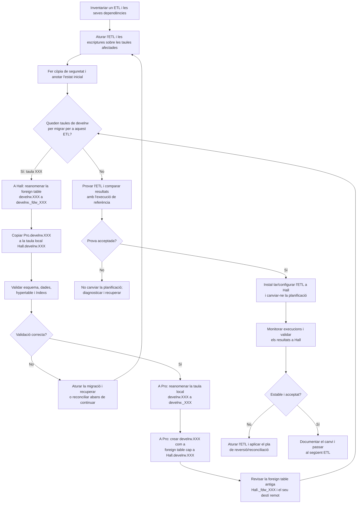

# Migrar scripts ETL de Pro a Hall

Procediment per migrar gradualment, script a script, els processos ETL que actualment s'executen a Pro perquè s'executin a Hall. La migració es fa d'una en una i inclou les taules de `develrw` que cada script utilitza.

## Abast i prerequisits

Aquest procediment parteix de la situació següent:

- Les taules dels esquemes `public` i `develrw` de Pro estan disponibles a Hall com a *foreign tables*.
- Hall pot connectar-se a Pro i consultar les taules que encara no s'han migrat.
- Es pot configurar també la connexió inversa, de Pro a Hall, per a les taules que ja s'hagin migrat.

Abans de començar:

1. Inventarieu el script ETL, la seva planificació (cron, servei o eina d'orquestració), les taules que llegeix i les que modifica, i qualsevol altre procés que en depengui.
2. Confirmeu que hi ha còpies de seguretat recuperables i una manera de tornar a executar o reconciliar el procés.
3. Planifiqueu una finestra de migració. Atureu temporalment les execucions que puguin modificar les taules afectades mentre se'n copia i valida el contingut. Si no és possible aturar-les, definiu prèviament com es copiaran els canvis produïts durant la migració.
4. Comproveu que els rols, permisos, extensions, fitxers de configuració, credencials i dependències del script també estan disponibles a Hall.

Per configurar les connexions `postgres_fdw`, consulteu [Configurar postgres_fdw](./configurar-postgres_fdw.md). Per copiar l'estructura i les dades d'una taula `develrw` a Hall, consulteu [Migrar taules develrw de Pro a Hall](./migrar-taules-develrw-de-pro-a-hall.md).

## Procediment per a cada script

Repetiu aquests passos per a cada script ETL. Si el script depèn de diverses taules de `develrw`, migreu i valideu totes les taules necessàries abans de canviar l'execució del script.

### 1. Inventariar i preparar

Per al script seleccionat, registreu:

- el nom i la ubicació del script, i la seva versió;
- les taules d'origen i de destinació, i si s'hi fan lectures, insercions, actualitzacions o eliminacions;
- les dependències indirectes (vistes, funcions, altres scripts i processos programats);
- els paràmetres d'execució, secrets i permisos necessaris;
- els resultats esperats i les comprovacions que permeten acceptar la migració.

Atureu l'ETL i qualsevol altre procés que pugui escriure a les taules afectades. Feu una còpia de seguretat i anoteu, com a mínim, el recompte de files, els valors mínim i màxim de les columnes rellevants i l'hora de l'última execució correcta.

### 2. Migrar cada taula `develrw` necessària

Per a cada taula `develrw.XXX`:

1. A Hall, reanomeneu la *foreign table* existent `develrw.XXX` a `develrw._fdw_XXX`. Això allibera el nom perquè la taula local migrada el pugui ocupar.
2. Creeu la taula local a Hall i copieu-hi les dades des de Pro seguint el procediment de [migració de taules](./migrar-taules-develrw-de-pro-a-hall.md). Valideu-ne l'estructura, la clau primària, la configuració de TimescaleDB si escau, les dades i els índexs.
3. Un cop validada la còpia, a Pro reanomeneu la taula local original `develrw.XXX` a `develrw._XXX`.
4. A Pro, creeu una *foreign table* anomenada `develrw.XXX` que apunti a la taula local `Hall.develrw.XXX`. Feu-ho amb el servidor, el *user mapping* i els permisos de connexió inversa configurats per a Pro.
5. Reviseu `Hall.develrw._fdw_XXX`: després de reanomenar la taula original a Pro, la *foreign table* antiga pot continuar apuntant al nom remot anterior. Si s'ha de conservar per a consulta o reversió, actualitzeu-ne l'opció `table_name` perquè apunti a `develrw._XXX`; si ja no cal i s'ha verificat que cap procés la fa servir, retireu-la seguint el procediment operatiu aprovat.

No elimineu les taules originals ni les *foreign tables* de reserva durant aquesta fase. El prefix `_` només les identifica com a objectes antics; no és una còpia de seguretat.

### 3. Provar l'ETL abans del canvi

Amb l'ETL encara aturat o executat en mode de prova:

1. Confirmeu que les consultes a `develrw.XXX` des de Pro ara arriben a la taula local de Hall.
2. Executeu les validacions funcionals i compareu els resultats amb els valors de referència. Comproveu també els logs, els temps d'execució i que no s'han produït efectes duplicats.
3. Si l'ETL escriu dades, confirmeu explícitament que les escriptures arriben a les taules previstes a Hall i que les operacions que utilitza són compatibles amb `postgres_fdw`.
4. No continueu si hi ha diferències no explicades. Manteniu l'execució original i corregiu les dades o la configuració abans de repetir la prova.

### 4. Traslladar l'execució a Hall

Quan les taules i la prova estiguin acceptades:

1. Instal·leu a Hall el mateix codi ETL revisat i les seves dependències. Configureu-hi els paràmetres i secrets de manera segura; no copieu credencials a la documentació ni al repositori.
2. Comproveu que les taules `public` i `develrw` no migrades encara són accessibles des de Hall mitjançant les *foreign tables* existents.
3. Canvieu la planificació perquè el script s'executi a Hall. Eviteu que el mateix ETL quedi actiu simultàniament a Pro i a Hall.
4. Executeu-lo i monitoritzeu logs, durada, recompte de registres i resultats funcionals. Registreu el moment del canvi i qui l'ha validat.

Si la validació falla, atureu noves execucions i seguiu el pla de reversió acordat. Abans de reactivar l'ETL a Pro, determineu si Hall ha escrit dades i com reconciliar-les; tornar a canviar la planificació sense reconciliar pot causar pèrdua o duplicació de dades.

## Tancament de cada migració

Després d'un període de monitoratge acordat:

- confirmeu que el procés només s'executa a Hall i que les sortides són correctes;
- actualitzeu l'inventari amb les taules migrades, l'estat de les antigues i les dependències pendents;
- conserveu les taules originals i les *foreign tables* de reserva fins que s'hagi aprovat formalment retirar-les i hi hagi una còpia recuperable;
- passeu al següent ETL i repetiu el procediment.

Quan tots els ETL s'hagin migrat, investigueu qualsevol taula de `develrw` encara activa a Pro o qualsevol *foreign table* a Hall que no s'hagi classificat. No elimineu tot l'esquema `develrw` de Pro només perquè els ETL coneguts funcionin a Hall: confirmeu abans que cap altre procés, usuari o aplicació en depèn.

!!! warning "Ubicació de l'script de còpia"
    El procediment de migració de taules fa referència a `projectes/energetica_utils/copia_dades_pro2hall.sh`, que no forma part d'aquest repositori. Confirmeu-ne la ubicació canònica, la versió i la capçalera d'ús abans d'executar-lo.
