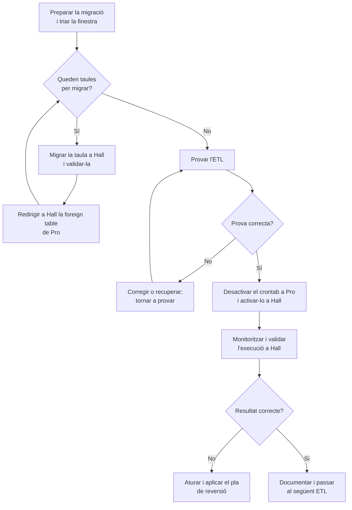

# Migrar scripts ETL de Pro a Hall

Procediment per traslladar gradualment a Hall els ETL que ara s'executen a Pro, un script cada vegada, amb les taules `develrw` de què depenen.

## Abast i prerequisits

Aquest procediment parteix de la situació següent:

- Les taules dels esquemes `public` i `develrw` de Pro estan disponibles a Hall com a *foreign tables*.
- Hall pot connectar-se a Pro i consultar les taules que encara no s'han migrat.
- Es pot configurar també la connexió inversa, de Pro a Hall, per a les taules que ja s'hagin migrat.

Abans de començar, inventarieu l'ETL (codi i versió, planificació, taules que llegeix o modifica i altres dependències), confirmeu una còpia de seguretat recuperable i comproveu que a Hall hi ha els rols, permisos, extensions, configuració i dependències necessaris. Definiu també com recuperar o reconciliar dades si la prova falla.

Per configurar les connexions `postgres_fdw`, consulteu [Configurar postgres_fdw](./configurar-postgres_fdw.md). Per copiar l'estructura i les dades d'una taula `develrw` a Hall, consulteu [Migrar taules develrw de Pro a Hall](./migrar-taules-develrw-de-pro-a-hall.md).

## Procediment per a cada script

Repetiu el procediment per a cada ETL. Si en depèn més d'una taula `develrw`, migreu-les i valideu-les totes abans de traslladar-ne l'execució.

### 1. Triar la finestra i preparar la prova

La majoria d'ETL s'executen una vegada al dia, durant la nit, i duren poc. No cal mantenir-los aturats durant tota la migració: planifiqueu cada canvi fora de l'horari d'execució del script afectat i comproveu als logs o al planificador que l'execució ha acabat. Eviteu que comenci una execució nova mentre canvieu les taules; si cal, desactiveu temporalment només la planificació d'aquell ETL.

Registreu les taules d'entrada i sortida, les dependències, els paràmetres i secrets, i els resultats esperats. Durant la còpia, eviteu escriptures concurrents a les taules afectades o definiu prèviament com capturareu i aplicareu els canvis posteriors. Anoteu valors de referència útils (per exemple, recompte de files i valors mínim/màxim) per comparar-los després.

### 2. Migrar i validar les taules `develrw`

Per a cada taula `develrw.XXX`:

1. A Hall, reanomeneu la *foreign table* existent `develrw.XXX` a `develrw._fdw_XXX`. Això allibera el nom perquè la taula local migrada el pugui ocupar.
2. Creeu la taula local a Hall i copieu-hi les dades des de Pro seguint el procediment de [migració de taules](./migrar-taules-develrw-de-pro-a-hall.md). Valideu l'estructura, la clau primària, TimescaleDB si escau, les dades i els índexs.
3. Un cop validada la còpia, a Pro reanomeneu la taula local original `develrw.XXX` a `develrw._XXX`.
4. A Pro, creeu una *foreign table* anomenada `develrw.XXX` que apunti a la taula local `Hall.develrw.XXX`. Feu-ho amb el servidor, el *user mapping* i els permisos de connexió inversa configurats per a Pro.
5. Reviseu `Hall.develrw._fdw_XXX`: després de reanomenar la taula original a Pro, la *foreign table* antiga pot continuar apuntant al nom remot anterior. Si s'ha de conservar per a consulta o reversió, actualitzeu-ne l'opció `table_name` perquè apunti a `develrw._XXX`; si ja no cal i s'ha verificat que cap procés la fa servir, retireu-la seguint el procediment operatiu aprovat.

No elimineu les taules originals ni les *foreign tables* de reserva durant aquesta fase. El prefix `_` només identifica objectes antics; no és una còpia de seguretat.

### 3. Provar i traslladar l'ETL

Abans de canviar la planificació:

1. Executeu l'ETL en mode de prova si en disposa; compareu sortides amb els valors de referència, reviseu logs i durada, i confirmeu que no hi ha efectes duplicats. Si escriu dades, verifiqueu que van a les taules previstes a Hall i que les operacions són compatibles amb `postgres_fdw`.
2. Si la prova és correcta, instal·leu a Hall el codi, dependències, configuració i secrets necessaris. Assegureu-vos que les taules encara no migrades continuen accessibles mitjançant les *foreign tables*.
3. Traieu o comenteu l'entrada de l'ETL del crontab de Pro. Per activar-la a Hall:
   1. Modifiqueu el fitxer `crontab` del repositori [`lenergetica/hall-cron`](https://github.com/lenergetica/hall-cron), afegiu-hi l'ETL amb l'horari correcte i feu push a `main`.
   2. A Dokploy, obriu el projecte `etl`, seleccioneu el servei `cron` i premeu **Deploy** perquè desplegui la darrera versió del repositori.
   3. Obriu un terminal al contenidor del servei `cron` i executeu `crontab -l`. Comproveu que l'entrada de l'ETL hi apareix amb l'horari esperat.
   4. Confirmeu que el mateix ETL no queda programat a Pro i Hall alhora. Registreu el canvi i monitoritzeu la primera execució (logs, durada i resultats).

Si hi ha errors o diferències, no activeu execucions addicionals: atureu l'ETL, determineu si Hall ha escrit dades i apliqueu el pla de reversió/reconciliació abans de reactivar-lo a Pro.

!!! note "Gestió dels ETL"
    Actualment, la configuració de cron de Hall es manté al fitxer `crontab` del repositori [`lenergetica/hall-cron`](https://github.com/lenergetica/hall-cron) i s'aplica desplegant el servei `cron` del projecte `etl` a Dokploy. A futur, es preveu gestionar els ETL amb [Prefect](https://docs.prefect.io/); la documentació interna sobre com registrar, programar i operar-los amb Prefect encara està pendent.

## Després de migrar

Documenteu l'estat de l'ETL i les taules antigues, i conserveu les taules originals i *foreign tables* de reserva fins que s'hagi validat el funcionament a Hall i s'aprovi formalment retirar-les. En acabar tots els ETL, investigueu qualsevol taula o dependència encara activa a Pro; no elimineu tot l'esquema `develrw` sense confirmar que cap altre procés, usuari o aplicació en depèn.

!!! warning "Ubicació de l'script de còpia"
    El procediment de migració de taules fa referència a `projectes/energetica_utils/copia_dades_pro2hall.sh`, que no forma part d'aquest repositori. Confirmeu-ne la ubicació canònica, la versió i la capçalera d'ús abans d'executar-lo.
