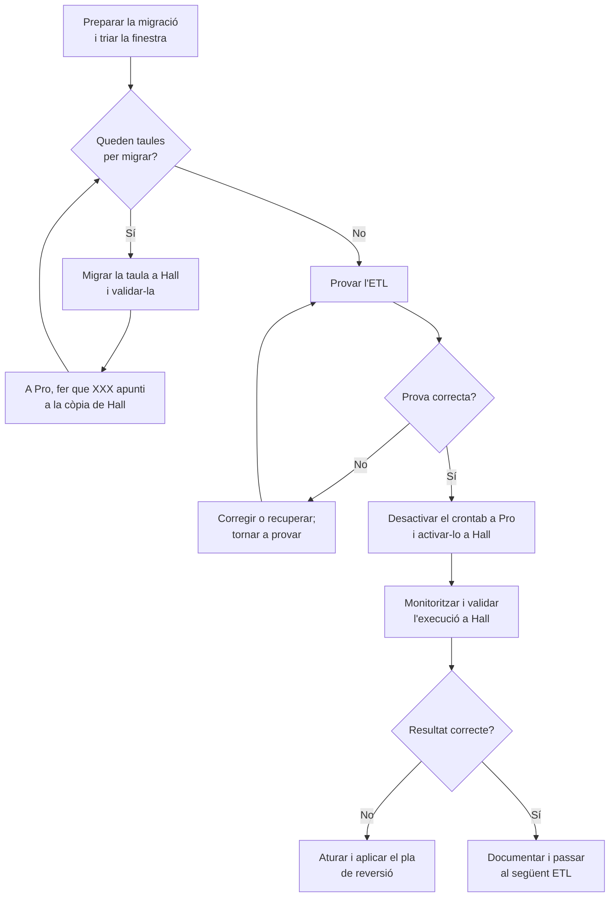

# Migrar scripts ETL de Pro a Hall

Procediment per traslladar gradualment a Hall els ETL que ara s'executen a Pro, un script cada vegada, amb les taules `develrw` de què depenen.

## Abast i prerequisits

La configuració inicial de `postgres_fdw` ja està feta: les taules de `public` i `develrw` de Pro estan importades a Hall com a *foreign tables*. Això permet que els ETL que encara s'executen a Pro continuïn funcionant inicialment a Hall sense canviar-ne les consultes, perquè les taules remotes són accessibles com si fossin locals.

La guia [Configuració inicial FDW i còpia pilot](migrar-taules-develrw-de-pro-a-hall.md) documenta aquesta configuració i la còpia pilot d'una taula. No cal repetir la configuració general de FDW per cada ETL. Aquest document és el procediment operatiu que sí que s'ha de repetir, una vegada per cada script.

Abans de cada migració, inventarieu l'ETL (codi i versió, planificació, taules que llegeix o modifica i altres dependències), confirmeu que hi ha una còpia de seguretat recuperable i comproveu que Hall disposa dels rols, permisos, extensions, configuració i dependències necessaris. Definiu com recuperar o reconciliar dades si la prova falla. Per a la configuració de connexió inversa de Pro cap a Hall, consulteu [Configurar postgres_fdw](configurar-postgres_fdw.md).

## Procediment per a cada script

Repetiu el procediment per a cada ETL. Si en depèn més d'una taula `develrw`, migreu-les i valideu-les totes abans de traslladar-ne l'execució.



### 1. Triar la finestra i preparar la prova

La majoria d'ETL s'executen una vegada al dia, durant la nit, i duren poc. No cal mantenir-los aturats durant tota la migració: planifiqueu cada canvi fora de l'horari d'execució del script afectat i comproveu als logs o al planificador que l'execució ha acabat. Eviteu que comenci una execució nova mentre canvieu les taules; si cal, desactiveu temporalment només la planificació d'aquell ETL.

Registreu les taules d'entrada i sortida, les dependències, els paràmetres i secrets, i els resultats esperats. Durant la còpia, eviteu escriptures concurrents a les taules afectades o definiu prèviament com capturareu i aplicareu els canvis posteriors. Anoteu valors de referència útils (per exemple, recompte de files i valors mínim/màxim) per comparar-los després.

### 2. Migrar les dependències d'aquest ETL

Feu aquests passos només per a les taules `develrw` que utilitza l'ETL actual. La idea és substituir a poc a poc, a mesura que migreu cada script, les *foreign tables* de Hall que apunten a Pro per taules locals de Hall. La resta de taules continua accessible des de Hall via FDW.

Per a cada taula `develrw.XXX` de què depèn:

1. **A Hall**, reanomeneu la *foreign table* existent `develrw.XXX` a `develrw._fdw_XXX`. Això allibera el nom `develrw.XXX` per a la còpia local:

    ```sql
    ALTER FOREIGN TABLE develrw.XXX
        RENAME TO _fdw_XXX;
    ```

2. **A Hall**, creeu la taula local `develrw.XXX` i copieu-hi les dades des de Pro seguint la referència tècnica de [còpia pilot i estructura de taula](migrar-taules-develrw-de-pro-a-hall.md). Valideu l'estructura i les dades. Abans de continuar, comproveu que la còpia local és la que s'utilitzarà.

3. **A Pro**, comproveu que el servidor `hall_server` existeix i que el rol actual pot fer-lo servir:

    ```sql
    SELECT srvname, srvowner::regrole, srvacl,
           has_server_privilege(current_user, srvname, 'USAGE') AS can_use
    FROM pg_foreign_server
    WHERE srvname = 'hall_server';
    ```

    Si no hi ha cap fila o `can_use` és `false`, atureu-vos i configureu el servidor, el `USER MAPPING` i els permisos segons [Configurar postgres_fdw](configurar-postgres_fdw.md).

4. **A Pro**, quan la còpia de Hall estigui validada i la taula local no estigui en ús, reanomeneu l'original a `_old_XXX` i importeu la taula migrada des de Hall amb el nom original. Així, els consumidors que encara consultin Pro continuen trobant `develrw.XXX`:

    ```sql
    ALTER TABLE develrw.XXX
        RENAME TO _old_XXX;

    IMPORT FOREIGN SCHEMA develrw
        LIMIT TO (XXX)
        FROM SERVER hall_server
        INTO develrw;
    ```

    Si l'ETL depèn de diverses taules, reanomeneu les originals a Pro amb prefix `_old_` i incloeu totes les taules migrades a `LIMIT TO`. Abans d'importar, confirmeu que els noms originals estan lliures.

5. **A Hall**, si voleu conservar `_fdw_XXX` com a referència a la còpia antiga de Pro, canvieu-ne el destí remot a `_old_XXX`. Això evita que la FDW apunti de retorn a Hall:

    ```sql
    ALTER FOREIGN TABLE develrw._fdw_XXX
        OPTIONS (SET table_name '_old_XXX');
    ```

    No elimineu les taules `_old_XXX` ni les `_fdw_XXX` fins que n'hàgiu comprovat les dependències i aprovat formalment la retirada.

Repetiu aquests passos per a totes les taules de `develrw` que utilitza aquest ETL abans de provar-lo. Els noms `XXX`, `_fdw_XXX` i `_old_XXX` són placeholders: substituïu-los consistentment pel nom de cada taula. La guia de taules és una referència tècnica basada en la còpia pilot de `apigisce_tgf1`; no és el runbook per migrar cada ETL.

### 3. Provar i traslladar l'ETL

Abans de canviar la planificació:

1. Executeu l'ETL en mode de prova si en disposa; compareu sortides amb els valors de referència, reviseu logs i durada, i confirmeu que no hi ha efectes duplicats. Si escriu dades, verifiqueu que van a les taules previstes a Hall i que les operacions són compatibles amb `postgres_fdw`.
2. Si la prova és correcta, instal·leu a Hall el codi, dependències, configuració i secrets necessaris. Assegureu-vos que les taules encara no migrades continuen accessibles mitjançant les *foreign tables*.
3. Traieu o comenteu l'entrada de l'ETL del crontab de Pro. Per activar-la a Hall:
   1. Modifiqueu el fitxer `crontab` del repositori [`lenergetica/hall-cron`](https://github.com/lenergetica/hall-cron), afegiu-hi l'ETL amb l'horari correcte i feu push a `main`.
   2. A Dokploy, obriu el projecte `etl`, seleccioneu el servei `cron` i premeu **Deploy** perquè desplegui la darrera versió del repositori.
   3. Obriu un terminal al contenidor del servei `cron` i executeu `crontab -l`. Comproveu que l'entrada de l'ETL hi apareix amb l'horari esperat.
   4. Confirmeu que el mateix ETL no queda programat a Pro i Hall alhora. Registreu el canvi i monitoritzeu la primera execució (logs, durada i resultats).

Si hi ha errors o diferències, no activeu execucions addicionals: atureu l'ETL, determineu si Hall ha escrit dades i apliqueu el pla de reversió/reconciliació abans de reactivar-lo a Pro.

!!! note "Gestió dels ETL"
    Actualment, la configuració de cron de Hall es manté al fitxer `crontab` del repositori [`lenergetica/hall-cron`](https://github.com/lenergetica/hall-cron) i s'aplica desplegant el servei `cron` del projecte `etl` a Dokploy. A futur, es preveu gestionar els ETL amb [Prefect](https://docs.prefect.io/); la documentació interna sobre com registrar, programar i operar-los amb Prefect encara està pendent.

## Després de migrar

Documenteu l'estat de l'ETL i les taules antigues, i conserveu les taules originals i *foreign tables* de reserva fins que s'hagi validat el funcionament a Hall i s'aprovi formalment retirar-les. En acabar tots els ETL, investigueu qualsevol taula o dependència encara activa a Pro; no elimineu tot l'esquema `develrw` sense confirmar que cap altre procés, usuari o aplicació en depèn.

!!! warning "Ubicació de l'script de còpia"
    El procediment de migració de taules fa referència a `projectes/energetica_utils/copia_dades_pro2hall.sh`, que no forma part d'aquest repositori. Confirmeu-ne la ubicació canònica, la versió i la capçalera d'ús abans d'executar-lo.
