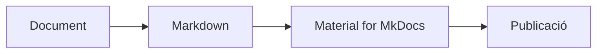

# Guia de referència de Markdown i Material for MkDocs

Aquesta pàgina és la referència principal de la Knowledge Base per crear documents amb Markdown i Material for MkDocs. Està pensada tant per a usuaris nous com per a persones que ja tenen experiència, i serveix com a guia pràctica per produir documentació clara, coherent i fàcil de mantenir.

La idea no és només escriure text, sinó crear documents que siguin:

- llegibles en una pantalla i en mòbil
- fàcils de cercar
- senzills de revisar i mantenir
- consistents entre equips i projectes

---

## 1. Objectiu de la Knowledge Base

La Knowledge Base serveix per documentar i compartir coneixement sobre:

- arquitectures i solucions tècniques
- procediments i runbooks
- infraestructura i serveis
- APIs i integracions
- telecomunicacions
- seguretat
- projectes i decisions tècniques
- formació i referència interna

L'objectiu és mantenir la documentació com a codi: versionada, revisable i fàcil de consultar.

---

## 2. Què és Markdown?

Markdown és un llenguatge de marcat senzill per estructurar documents sense necessitat d'un editor visual. Permet crear títols, llistes, enllaços, taules, blocs de codi i altres elements útils per a la documentació tècnica.

### Exemple bàsic

```md
# Títol principal

## Subtítol

- Element 1
- Element 2
- Element 3

**Text en negreta** i *text en cursiva*.

[Documentació de Markdown](https://www.markdownguide.org/)
```

El resultat és:

# Títol principal

## Subtítol

- Element 1
- Element 2
- Element 3

**Text en negreta** i *text en cursiva*.

[Documentació de Markdown](https://www.markdownguide.org/)

Markdown és la base del contingut. Material for MkDocs és la capa que millora la presentació i la navegació.

---

## 3. Markdown bàsic: elements essencials

### 3.1 Encapçalaments

```md
# Títol principal
## Secció
### Subsecció
#### Detall
```

Es recomana mantenir una jerarquia clara i evitar salts de nivell arbitraris.

### 3.2 Èmfasi i format del text

```md
**negreta**
*italic*
~~ratllat~~
`codi inline`
```

Resultat visual:

**negreta**
*italic*
~~ratllat~~
`codi inline`

### 3.3 Llistes

#### Llista no ordenada

```md
- Primer element
- Segon element
- Tercer element
```

Resultat visual:

- Primer element
- Segon element
- Tercer element

#### Llista ordenada

```md
1. Primer pas
2. Segon pas
3. Tercer pas
```

Resultat visual:

1. Primer pas
2. Segon pas
3. Tercer pas

#### Llista de tasques

```md
- [x] Documentació actualitzada
- [ ] Revisar punts pendents
- [ ] Confirmar informació crítica
```

Resultat visual:

- [x] Documentació actualitzada
- [ ] Revisar punts pendents
- [ ] Confirmar informació crítica

### 3.4 Citacions

```md
> Aquesta informació és important i cal tenir-la en compte.
```

Resultat visual:

> Aquesta informació és important i cal tenir-la en compte.

### 3.5 Enllaços

```md
[Veure SmartLogger](ot/smartlogger.md)
[GitHub](https://github.com)
```

Resultat visual:

[Veure SmartLogger](ot/smartlogger.md)
[GitHub](https://github.com)

Preferiu rutes relatives internes coherents amb la estructura del repositori.

### 3.6 Imatges

```md

```

Resultat visual:


Si la imatge aporta informació important, incloeu sempre un text alternatiu descriptiu.

### 3.7 Taules

```md
| Columna 1 | Columna 2 | Columna 3 |
|-----------|-----------|-----------|
| Valor 1   | Valor 2   | Valor 3   |
| Valor 4   | Valor 5   | Valor 6   |
```

Resultat visual:

| Columna 1 | Columna 2 | Columna 3 |
|-----------|-----------|-----------|
| Valor 1   | Valor 2   | Valor 3   |
| Valor 4   | Valor 5   | Valor 6   |

### 3.8 Blocs de codi

````md
```bash
mkdocs serve
```
````

Es recomana especificar el llenguatge del bloc perquè el ressaltat de sintaxi sigui correcte.

```bash
mkdocs serve
```

### 3.9 Codi inline

```md
La comanda per iniciar el servei és `mkdocs serve`.
```

---

## 4. Material for MkDocs: funcions útils

Material for MkDocs afegeix elements visuals i estructurals que milloren la navegació i la lectura dels documents.

### 4.1 Admonicions

```md
!!! note
    Aquesta és una nota informativa.

!!! warning
    Aquest és un avís que cal tenir en compte.

!!! tip
    Aquí podeu afegir una recomanació útil.
```

Resultat:

!!! note
    Aquesta és una nota informativa.

!!! warning
    Aquest és un avís que cal tenir en compte.

!!! tip
    Aquí podeu afegir una recomanació útil.

També podeu donar un títol explícit:

```md
!!! warning "Atenció"
    Els canvis en producció han de passar per Pull Request.
```

### 4.2 Blocs desplegables

```md
??? info "Veure més detalls"
    Aquí es pot afegir informació addicional.
```

Resultat:

??? info "Veure més detalls"
    Aquí es pot afegir informació addicional.

### 4.3 Pestanyes

La sintaxi correcta de Material per a pestanyes és aquesta:

````md
=== "Windows"
    ```powershell
    mkdocs serve
    ```

=== "Linux/macOS"
    ```bash
    mkdocs serve
    ```
````

Resultat visual:

=== "Windows"
    ```powershell
    mkdocs serve
    ```

=== "Linux/macOS"
    ```bash
    mkdocs serve
    ```

### 4.4 Emoji i iconografia

```md
:warning: Atenció
:rocket: Implementació
:check: Validat
```

Resultat visual:

:warning: Atenció
:rocket: Implementació
:check: Validat

### 4.5 Llistes de tasques interactives

```md
- [ ] Revisar el document
- [x] Aplicar el canvi
- [ ] Validar el resultat
```

Resultat visual:

- [ ] Revisar el document
- [x] Aplicar el canvi
- [ ] Validar el resultat

### 4.6 Codi amb còpia ràpida

La configuració del site habilita un botó de còpia en els blocs de codi per facilitar la reutilització de comandes.

```bash
echo "Exemple de codi"
```

Resultat visual:

```bash
echo "Exemple de codi"
```

### 4.7 Tecles ràpides

Material també permet mostrar tecles de teclat amb estil:

```md
Prem ++ctrl+c++ per copiar.
Prem ++ctrl+v++ per enganxar.
```

Resultat visual:

Prem ++ctrl+c++ per copiar.
Prem ++ctrl+v++ per enganxar.

---

## 5. Diagrames amb Mermaid

Material for MkDocs permet incloure diagrames Mermaid dins dels documents. La sintaxi és la següent:

````md

````

Resultat visual:


Els diagrames són útils quan el flux, l'arquitectura o les relacions entre components són difícils de transmetre només amb text.

---

## 6. Metadades del document (YAML Front Matter)

Cada fitxer pot incloure metadades a l'inici en format YAML. Aquestes dades ajuden a classificar, revisar i gestionar la documentació del repositori.

### Exemple complet

```yaml
---
title: Configuració SmartLogger
author: José Antonio Arias
owner: Tech
status: approved
version: 1.2
review_date: "2026-10-02"
review_period_months: 6 #6 is the default
tags:
  - smartlogger
  - huawei
  - ot
site: Cardedeu
created: "2026-09-01"
---

# Configuració SmartLogger
```

### Camps recomanats

#### `title`

Títol visible del document.

```yaml
title: Configuració SmartLogger
```

#### `author`

Autor original del document.

```yaml
author: José Antonio Arias
```

#### `owner`

Equip responsable.

```yaml
owner: Tech
```

#### `status`

Estat del document.

```yaml
status: draft
status: review
status: approved
status: deprecated
```

#### `version`

Versió funcional del document.

```yaml
version: 1.0
```

#### `review_date`

Data de la darrera revisió funcional.

```yaml
review_date: "2026-10-02"
```

#### `review_period_months`

Cadència recomanada de revisió.

```yaml
review_period_months: 6
```

#### `tags`

Etiquetes per classificar el document.

```yaml
tags:
  - smartlogger
  - huawei
  - runbook
```

#### `site`

Ubicació o instal·lació relacionada.

```yaml
site: Cardedeu
```

---

## 7. Estructura recomanada per als documents

Una estructura coherent facilita la cerca i manté la documentació ordenada.

```text
docs/
  index.md
  telecom/
    cardedeu.md
  ot/
    smartlogger.md
  contribute/
    contribute.md
```

### Recomanacions bàsiques

- Comença sempre amb un títol clar.
- Explica la finalitat del document al principi.
- Agrupa la informació en seccions lògiques.
- Utilitza enllaços interns quan siguin útils.
- Mantingues els documents breus i accionables.

---

## 8. Bones pràctiques per a la documentació

### Escriu de manera clara

- Utilitza frases curtes i directes.
- Prioritza la informació útil a la part superior.
- Evita duplicar informació que ja existeix en altres documents.

### Mantén la consistència

- Utilitza el mateix format de títols i llistes.
- Respecta la jerarquia de seccions.
- Segueix patrons similars de metadades i estructura.

### Fes la documentació útil

- Descriu què fa el sistema o procés.
- Afegix passos clars i exemples concrets.
- Inclou advertències quan hi hagi riscos o dependències.

### No abusis dels elements visuals

Taules, avisos i diagrames són útils, però no han d'ofegar el contingut. L'objectiu és ajudar a la comprensió, no saturar la lectura.

---

## 9. Plantilla mínima de document

Podeu partir d'aquesta plantilla per crear documents nous.

```yaml
---
title: Nom del document
author: Nom de l'autor
owner: Equip responsable
status: draft
version: 1.0
review_date: "2026-10-02"
review_period_months: 6
tags:
  - documentació
  - guia
site: Cardedeu
---

# Nom del document

## Objectiu

Explica què cobreix aquest document.

## Context

Quin és el context i quan s'ha d'utilitzar.

## Procediment

1. Primer pas
2. Segon pas
3. Tercer pas

## Consideracions

- Punts importants
- Dependències
- Riscos o advertències
```

---

## 10. Comprovació ràpida abans de publicar

Abans d'acceptar un document, revisa:

- [ ] El títol és clar i descriptiu.
- [ ] Hi ha una introducció amb l'objectiu.
- [ ] Les seccions estan ben ordenades.
- [ ] Els enllaços interns són correctes.
- [ ] Les metadades estan completes i coherents.
- [ ] La informació és útil per a altres persones del equip.
- [ ] El document és fàcil de llegir en mòbil i ordinador.

---

## 11. Exemple d'ús real a la KB

```md
# Configuració del node de telecomunicacions

## Objectiu

Aquest document descriu la configuració base del node.

## Requisits

- Accés a la consola
- Credencials del sistema
- Connexió a la xarxa

## Procediment

1. Verificar l'energia.
2. Comprovar la connexió de xarxa.
3. Accedir a la interfície de configuració.

!!! warning
    No esborrar la configuració actual sense tenir una còpia de seguretat.
```

---

## 12. Exemples de documents útils a la KB

### 12.1 Exemple d'incidència

````md
# Incidència: SmartLogger no envia dades

## Resum

Un SmartLogger ha deixat d'enviar dades.

## Impacte

- Monitorització afectada
- Sense afectació a producció

## Diagnòstic

```powershell
Test-NetConnection 192.168.1.10 -Port 502
```

## Resolució

```bash
systemctl restart smartlogger
```

## Verificació

- [x] Comunicació recuperada
- [x] Dades rebudes
- [x] Operació normal
````

### 12.2 Exemple de runbook

````md
# Runbook: Reiniciar un SATEL XPRS

## Objectiu

Reiniciar un SATEL XPRS.

## Prerequisits

- Accés VPN
- Credencials d'administrador

## Procediment

1. Connectar-se al dispositiu.

   ```bash
   ssh admin@satel01
   ```

2. Comprovar l'estat.

   ```bash
   show status
   ```

3. Reiniciar.

   ```bash
   reboot
   ```

4. Verificar recuperació.

   ```bash
   ping 192.168.1.20
   ```

## Resultat esperat

- SATEL accessible
- Comunicació restablerta
````

### 12.3 Exemple de documentació d'API

````md
# Endpoint: consulta de planta

## Endpoint

```http
GET /api/plants/{id}
```

## Exemple de resposta

```json
{
  "id": 25,
  "name": "Cardedeu",
  "status": "online",
  "powerKw": 100
}
```
````

---

## 13. Referència ràpida

| Element | Sintaxi | Ús habitual |
|---------|---------|--------------|
| Títol | `#` / `##` / `###` | Estructura del document |
| Negreta | `**text**` | Emfasitzar conceptes |
| Cursiva | `*text*` | Toques visuals |
| Enllaç | `[text](url)` | Referències externes o internes |
| Imatge | `` | Visuals i diagrames |
| Llista | `- item` | Elements no ordenats |
| Llista numerada | `1. item` | Procediments pas a pas |
| Codi | ```` ```bash ```` | Comandes i snippets |
| Avis | `!!! note` | Informació important |
| Pestanyes | `===` | Alternatives o variants |
| Taula | `| col | col |` | Comparació de dades |

---

## 14. Resum

Markdown i Material for MkDocs formen una combinació potent per documentar processos, infraestructures i coneixements tècnics de manera clara i mantenible.

La clau és:

- mantenir el contingut simple i direct
- usar la jerarquia adequada
- evitar informació duplicada
- documentar amb exemples reals
- revisar la documentació periòdicament

Si segueixes aquests patrons, la Knowledge Base serà útil tant per a usuaris nous com per a persones amb experiència.

---

## 15. Enllaços útils

- [Markdown Guide](https://www.markdownguide.org/)
- [Material for MkDocs](https://squidfunk.github.io/mkdocs-material/)
- [Documentació de MkDocs](https://www.mkdocs.org/)
- Automatització
- Possibilitat d'integració amb IA

---

## Annex: Referència ràpida Markdown

### Negreta

```md
**text**
```

**text**

### Cursiva

```md
*text*
```

*text*

### Codi inline

```md
`SELECT * FROM users`
```

`SELECT * FROM users`

### Llista

```md
- Element 1
- Element 2
```

### Numeració

```md
1. Pas 1
2. Pas 2
```

### Taula

```md
| Camp | Valor |
|------|------|
| Nom | Josep |
```

---

## Fi de la demostració

Si veus correctament totes les seccions anteriors (admonitions, Mermaid, tabs, checklists, snippets, codi, taules i diagrames), la instal·lació de MkDocs Material està funcionant correctament.


----

Etiquetes
draft_warning
review-warning
