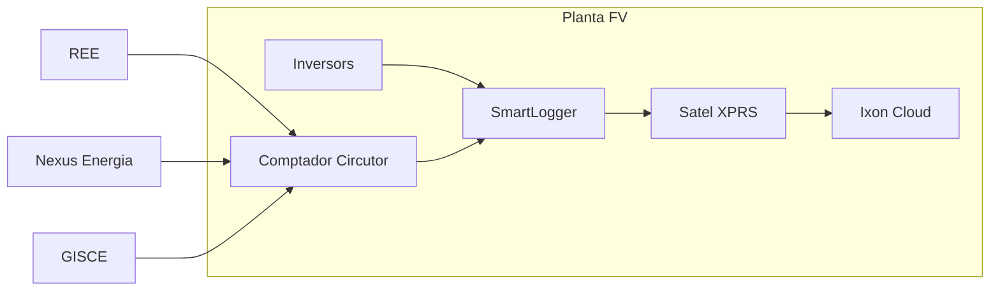
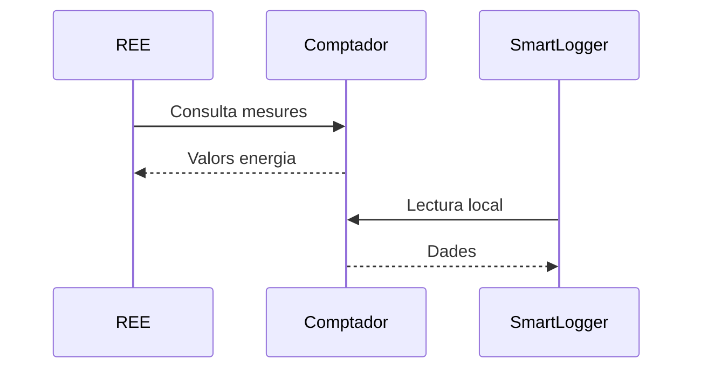

# Tech Knowledge Base

Benvinguts a la base de coneixement de l'equip Tech.


# Plataforma de Monitorització FV

## Descripció

Aquesta pàgina documenta l'arquitectura de monitorització remota de les plantes FV.

!!! note
    Aquest document és la font oficial de referència per als equips Tech i Operacions.

!!! warning
    Qualsevol canvi de configuració haurà de passar per Pull Request.

---

## Arquitectura



---

## Components

| Component | Funció | Crític |
|------------|---------|---------|
| SmartLogger | Concentrador Huawei | Sí |
| Satel XPRS | Datalogger | Sí |
| Ixon | Accés remot | No |
| Comptador Circutor | Mesura fiscal | Sí |

---

## Flux de comunicació



---

## Configuració de xarxa

=== "YAML"

```yaml title="network.yaml" linenums="1"
    smartlogger:
      ip: 192.168.1.10
      port: 502

    satel:
      ip: 192.168.1.20
      port: 5000
```

=== "JSON"

```json
    {
      "smartlogger": {
        "ip": "192.168.1.10",
        "port": 502
      }
    }
```

=== "PowerShell"

```powershell
    Test-NetConnection 192.168.1.10 -Port 502
```

---

## Verificació de connectivitat

### Ping

```bash title="Verificació ràpida"
ping 192.168.1.10
```

### Consulta Modbus

```python title="modbus_test.py"
from pymodbus.client import ModbusTcpClient

client = ModbusTcpClient("192.168.1.10")
client.connect()

result = client.read_holding_registers(1,1)

print(result.registers)
```

---

## Exemple API

### Request

```http
POST /api/v1/plants
Host: monitor.cat
Authorization: Bearer TOKEN
```

### Body

```json
{
  "name": "Cardedeu",
  "powerKw": 100
}
```

### Response

```json
{
  "id": 123,
  "status": "created"
}
```

---

## Canvi de configuració

```diff
- modem.enabled=false
+ modem.enabled=true
```

---

## Checklist de validació

- [x] SmartLogger operatiu
- [x] Comptador accessible
- [x] SATEL comunicant
- [ ] REE validat
- [ ] NEXUS validat
- [ ] GISCE validat

---

## Procediment detallat

??? info "Veure procediment complet"

### Pas 1

Verificar alimentació.

### Pas 2

Connectar-se al SmartLogger.

```bash
    ssh admin@192.168.1.10
```

### Pas 3

Executar diagnòstic.

```bash
    show status
```

---

## Bones pràctiques

!!! tip
    Utilitzar IPs fixes per a tots els equips industrials.

!!! danger
    No exposar mai el SmartLogger directament a Internet.

---

## Comandes habituals

=== "Git"

```bash
    git checkout main
    git pull
```

=== "Docker"

```bash
    docker compose up -d
```

=== "PostgreSQL"

```sql
    SELECT *
    FROM plants
    WHERE active = true;
```

---

## Decisió d'arquitectura

> La connectivitat crítica per a REE i Centre de Control ha de ser independent
> dels mecanismes de monitorització i operació remota.

---

## Referències

- https://support.huawei.com
- https://modbus.org

---


## Àrees

- Arquitectura
- Telecomunicacions
- OT
- Ciberseguretat
- Procediments


## Altres recursos

- [le-cuisine/README.md](https://github.com/lenergetica/le-cuisine/blob/main/README.md)
